# Excel Learning Series — Part 1: Understanding the Basics

Personal learning notes on Microsoft Excel fundamentals, enhanced with screenshots and explanations. This is Part 1 of an ongoing Excel learning series — it covers the foundational skills you need before moving on to formulas, functions, and data analysis.

## 📑 Table of Contents

1. [Understanding Excel Layout](#1-understanding-excel-layout)
2. [Workbook vs Worksheet](#2-workbook-vs-worksheet)
3. [Ribbons, Tabs, Groups, and Menus](#3-ribbons-tabs-groups-and-menus)
4. [Customizing the Quick Access Toolbar](#4-customizing-the-quick-access-toolbar)
5. [Cells, Rows, and Columns](#5-cells-rows-and-columns)
6. [Saving, Undo & Redo](#6-saving-undo--redo)
7. [Intelligent Navigation](#7-intelligent-navigation)
8. [Selecting Ranges](#8-selecting-ranges)
9. [Copying & Pasting Mastery](#9-copying--pasting-mastery)
10. [Basic Arithmetic Operations](#10-basic-arithmetic-operations)
11. [Cell Referencing](#11-cell-referencing)
12. [Different Techniques of Fills](#12-different-techniques-of-fills)

---

## 1. Understanding Excel Layout

Before diving into formulas or data, it helps to know the anatomy of the Excel window: the **Title Bar** at the top, the **Ribbon** below it (Home, Insert, Draw, etc.), the **Formula Bar** where you see and edit cell content, the **grid** of cells itself, the **sheet tabs** at the bottom, and the **Status Bar** at the very bottom showing quick stats like Sum/Average/Count of a selection.

## 2. Workbook vs Worksheet

- A **Workbook** is the entire Excel file (e.g. `SalesReport.xlsx`) — think of it as the *book*.
- A **Worksheet** (or just *sheet*) is a single page/tab inside that book (e.g. `Sheet1`, `Jan-Sales`, `Summary`).

So one workbook can contain many worksheets, just like one book can have many pages — each worksheet has its own grid of cells but they all live inside the same file.

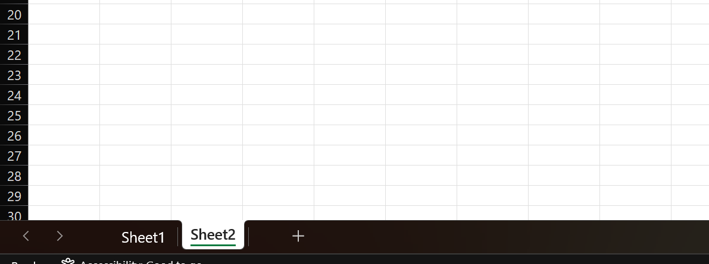

## 3. Ribbons, Tabs, Groups, and Menus

Excel's toolbar area is organized in a hierarchy, from largest to smallest:

- **Tabs** — the top-level categories like *Home*, *Insert*, *Draw*, *Page Layout*, *Formulas*, *Data*, *Review*, *View*. Clicking a tab changes what the Ribbon below it shows.

  

- **Ribbon** — the strip of icons and commands that appears under the selected tab.

  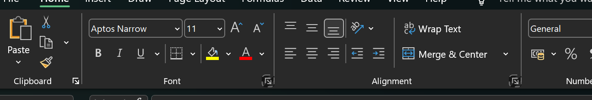

- **Groups** — the Ribbon itself is split into labelled sections, e.g. under the *Home* tab you'll find the **Clipboard**, **Font**, and **Alignment** groups. Each group bundles related commands together so they're easy to find.

  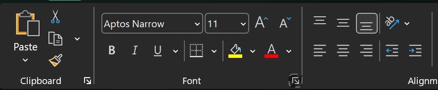

- **Menus** — smaller dropdowns or expandable options within a group, for example the Bold/Italic/Underline options under the Font group.

  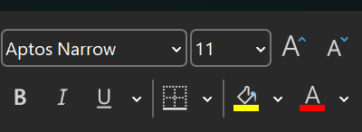

**Tip:** Learning this hierarchy (Tab → Ribbon → Group → Menu) makes it much faster to find any command, since Microsoft organizes almost every feature this same way.

## 4. Customizing the Quick Access Toolbar

The **Quick Access Toolbar (QAT)** sits above (or below) the Ribbon and holds your most frequently used commands — like Save, Undo, and Redo — so you don't have to hunt for them inside a tab every time.

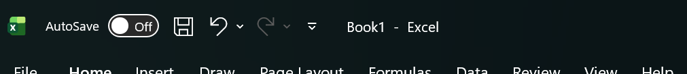

You can customize it by clicking the small dropdown arrow at the end of the toolbar and choosing **More Commands**, which opens a dialog where you can add or remove any command from any tab.

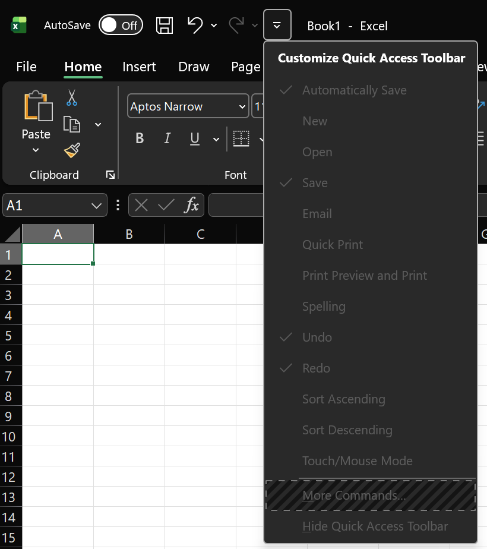

At the very bottom of the Excel window is the **Status Bar**. Besides showing quick calculations (Sum, Average, Count) for a selected range, it also has the **zoom slider** and **page layout view switcher** in the bottom-right corner.

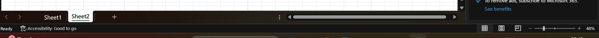

## 5. Cells, Rows, and Columns

The spreadsheet grid is made of **columns** (labelled with letters: A, B, C…), **rows** (labelled with numbers: 1, 2, 3…), and **cells**, which are the intersection of a column and a row.

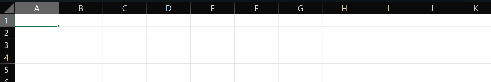

### Naming and Selecting

Every cell has a unique address, built as **[Column][Row]** — for example, the cell in column A, row 1 is named **A1**. Whichever cell is currently selected shows its name in the **Name Box** at the top-left, just above column A.

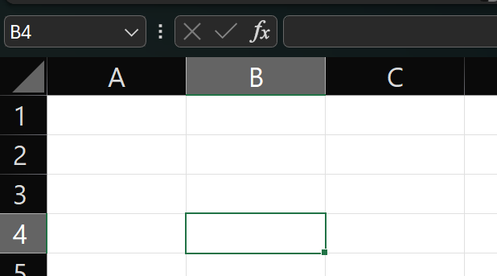

### Formatting

Cells can be formatted independently of their content — font, color, borders, number format (currency, date, percentage), and more, all from the Home tab or the Format Cells dialog (`Ctrl + 1`).

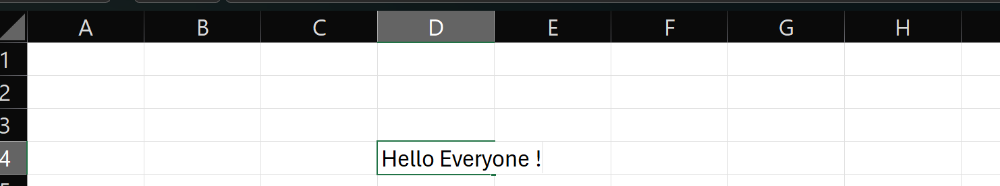

### Auto-Adjusting

To make a column or row automatically resize to fit its content, **double-click the border** between two column headers or two row headers. This works the same way for both — hover exactly on the boundary line until the cursor changes to a resize icon, then double-click.

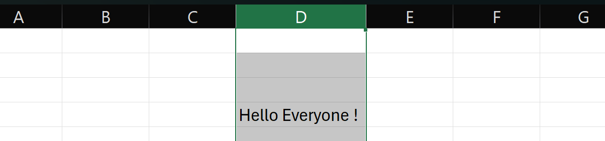

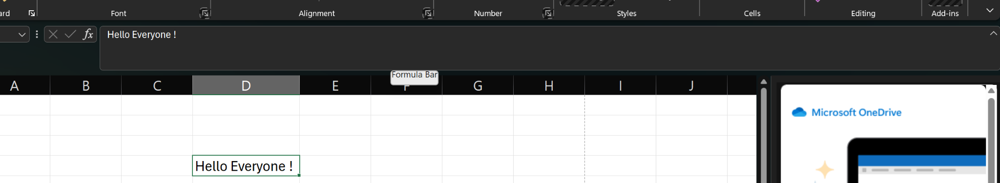

**Useful shortcuts while editing:**
- `Ctrl + Z` → Undo
- `Ctrl + Y` → Redo
- `F2` (or double-click a cell) → Edit the cell in place — double-clicking is usually the easiest way to jump straight into a cell's content.

**Default alignment behavior** (a good way to sanity-check your data at a glance):
- **Text** → aligns to the **bottom-left** by default
- **Numbers** → align to the **bottom-right** by default

You can override this from the **Alignment group** on the Home tab.

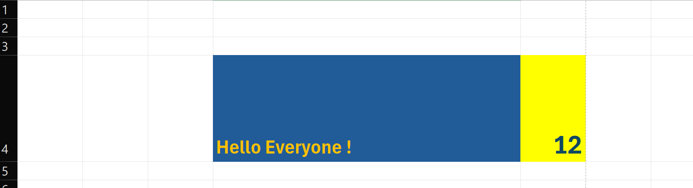

**Wrap Text** keeps the column width fixed but expands the **row height** so long text wraps onto multiple lines instead of spilling into neighboring cells.

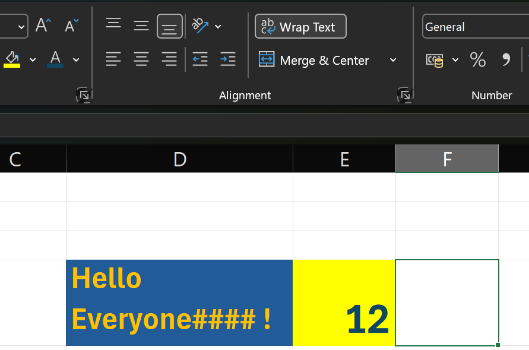

To remove formatting/content from a cell, select it and use the **Clear** (eraser icon) button on the Home tab — this lets you choose to clear formats, contents, comments, or everything.

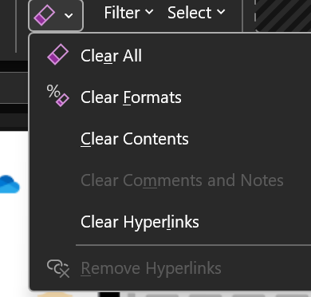

**Merge & Center vs. Center Across Selection:**

- **Merge & Center** visually combines multiple cells into one and centers the text — but it permanently changes the underlying cell structure, which can break formulas, sorting, and filtering later on.
- A safer alternative: **Center Across Selection**, found under `Format Cells → Alignment → Horizontal`. It gives the *same visual effect* as merging without actually merging the cells — so your data structure stays intact. This is generally the recommended approach.

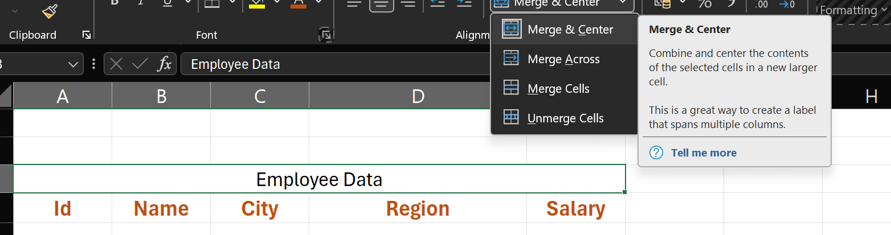

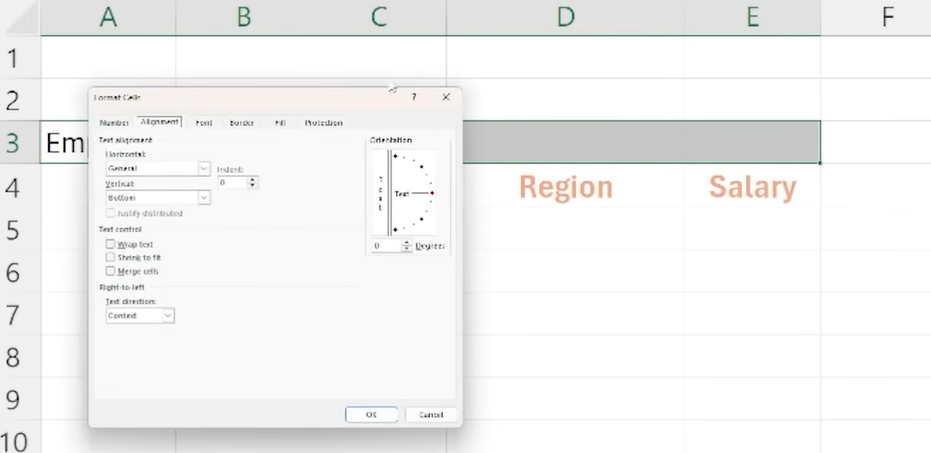

### Creating & Deleting

- `Ctrl + Shift + '+'` → Insert a new row or column
- `Ctrl + '-'` → Delete a selected row or column

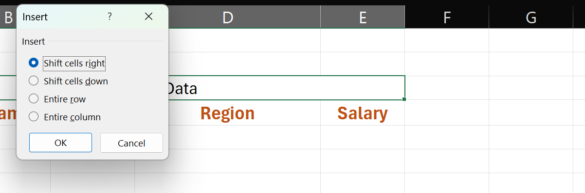

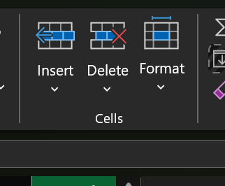

## 6. Saving, Undo & Redo

`Ctrl + S` saves the file — if it's linked to OneDrive, this also syncs it to the cloud. You can also save via **File → Save** or **File → Save As**.

**Save vs. Save As** — the distinction matters:

| Action | What it does |
|---|---|
| **Save** | Updates the *same* file, overwriting the previous version |
| **Save As** | Creates a *new* file, leaving the original untouched |

**Example:** Suppose you have a file named `SalesReport.xlsx`.
- Using **Save** updates that same `SalesReport.xlsx`.
- Using **Save As** could create `SalesReport_Final.xlsx`, `SalesReport_2026.xlsx`, or a copy in a different folder or file format entirely.

**Save As is commonly used for:**
- Creating backups
- Making multiple versions of the same file
- Changing the file format (`.xlsx`, `.csv`, `.xls`)
- Saving a copy to a different location

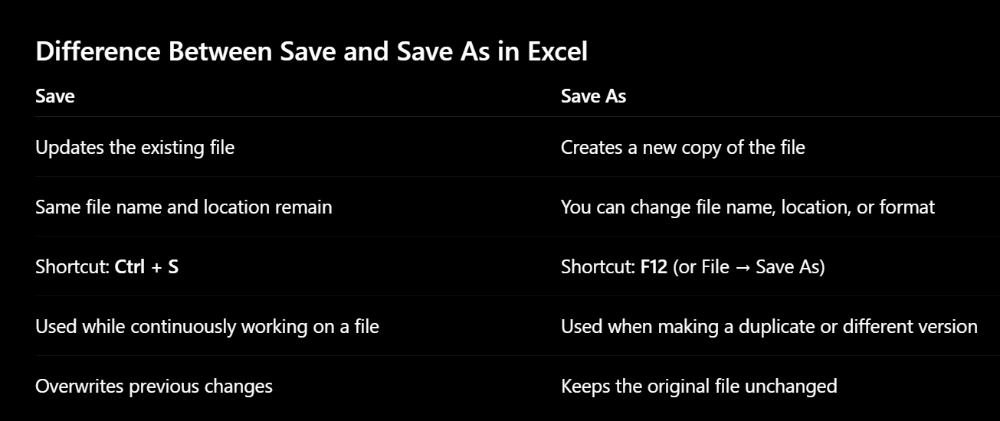

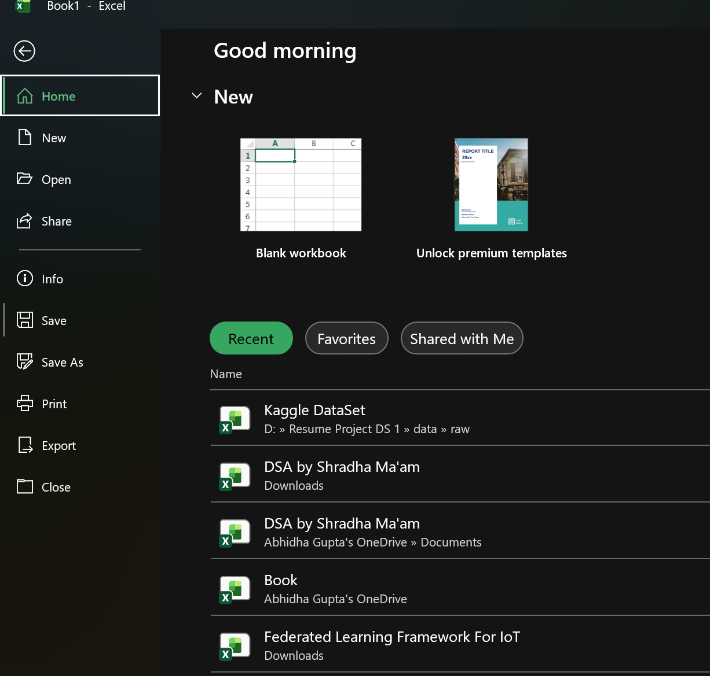

## 7. Intelligent Navigation

Excel has keyboard shortcuts that let you jump around large sheets instantly instead of scrolling:

- `Ctrl + Arrow key` (→ ← ↑ ↓) → Jumps to the edge of the current block of data in that direction
- `Ctrl + Home` → Jumps to cell A1
- `Ctrl + End` → Jumps to the last used cell in the sheet
- `Page Up` / `Page Down` → Moves one screen's worth up or down
- `Ctrl + Shift + Arrow key` → Selects a range while jumping to the edge of the data block (see [Selecting Ranges](#8-selecting-ranges) below)

## 8. Selecting Ranges

- `Ctrl + A` → Selects the entire block of used data (press it again to select the whole sheet)
- `Ctrl + Shift + Arrow key` → Extends the selection from the active cell to the edge of the data in that direction
- Clicking the small triangle in the **top-left corner** of the grid (above row 1, left of column A) → Selects the **entire worksheet** at once

## 9. Copying & Pasting Mastery

The classic clipboard shortcuts, all under the **Clipboard group** on the Home tab:

- `Ctrl + X` → Cut
- `Ctrl + C` → Copy
- `Ctrl + V` → Paste
- `Ctrl + Alt + V` → **Paste Special** — opens a dialog with granular paste options (values only, formulas only, formats only, transpose, etc.), instead of pasting everything by default

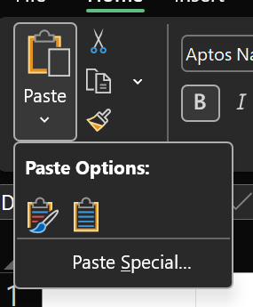

**Why Paste Special matters:** a normal paste brings over *everything* — formulas, formatting, borders, and comments — which isn't always what you want. Paste Special lets you pick exactly what transfers, which is especially useful when pasting values only (to strip out formulas) or pasting formats only (to copy styling without touching the numbers).

## 10. Basic Arithmetic Operations

Every formula in Excel starts with an `=` sign — this is the signal that tells Excel "calculate this" instead of treating it as plain text.

The four basic operators:

| Operator | Operation | Example |
|---|---|---|
| `+` | Addition | `=A1+A2` |
| `-` | Subtraction | `=A1-A2` |
| `*` | Multiplication | `=A1*A2` |
| `/` | Division | `=A1/A2` |

There are two ways to use these — and the difference is important:

**1. Static calculation** — typing the raw numbers directly into the formula (e.g. `=5+10`). This gives a fixed result that never changes, even if related data elsewhere on the sheet changes.

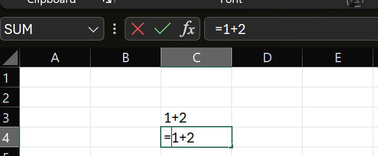

**2. Cell referencing (dynamic)** — using cell addresses instead of raw numbers (e.g. `=A1+A2`). Now the result updates automatically whenever the values in A1 or A2 change. This is the real power of Excel, and it's the foundation for everything you'll build later — dynamic reports, dashboards, and models all rely on this.

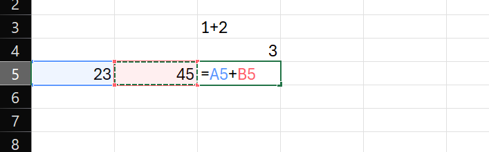

**In-built functions** are pre-written formulas for common operations, e.g. `=SUM(A1:A10)`, `=AVERAGE(A1:A10)`, `=COUNT(A1:A10)`. They save you from writing out long chains of `+` signs and are less error-prone for large ranges.

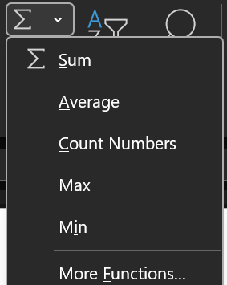

## 11. Cell Referencing

This is one of the most important Excel concepts — it's what makes formulas "smart" when you copy or drag them across a range. There are three types:

### Relative Reference

The default type — e.g. `A1`. When you copy or drag a formula that uses a relative reference, Excel automatically adjusts the reference based on the new position. This is what makes autofill so powerful: drag `=A1+B1` down one row and it automatically becomes `=A2+B2`.

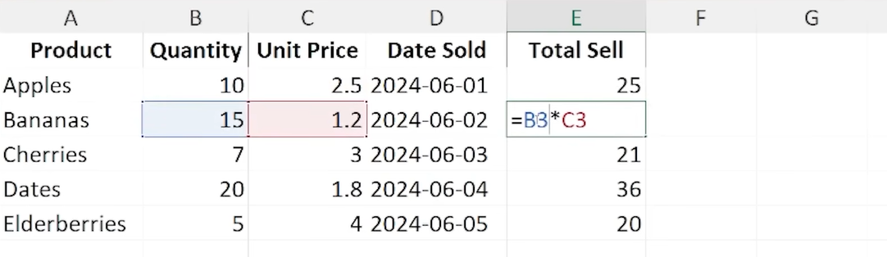

### Absolute Reference

Written with a `$` sign before the column and/or row (e.g. `$A$1`). The `$` **locks** that part of the reference so it stays fixed no matter where you copy or drag the formula — useful for something like a tax rate or exchange rate stored in a single cell that every row needs to reference.

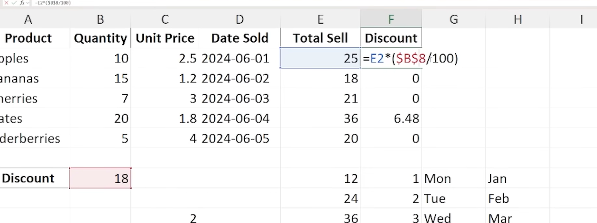

### Mixed Reference

A hybrid of the two — only the column *or* the row is locked, not both (e.g. `$E1` locks column E but lets the row change, or `E$1` locks row 1 but lets the column change). Useful when building tables where one axis should stay fixed and the other should move (e.g. multiplication tables, lookup grids).

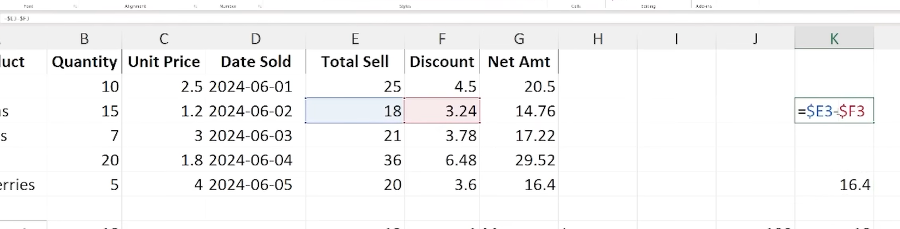

**Quick reference table:**

| Type | Syntax | Locks | Use case |
|---|---|---|---|
| Relative | `A1` | Nothing | Formulas that should adjust per row/column |
| Absolute | `$A$1` | Column & Row | A single fixed value used everywhere (rate, constant) |
| Mixed | `$A1` or `A$1` | Column *or* Row | Tables/grids where only one axis is fixed |

**Tip:** Press `F4` while editing a formula to quickly cycle through relative → absolute → mixed reference styles for the selected cell reference.

## 12. Different Techniques of Fills

### Copy Filling (the Fill Handle)

Every selected cell or range has a small square in its bottom-right corner called the **Fill Handle**. Click and drag it to copy the formula or value into adjacent cells — this is the fastest way to extend formulas or patterns down a column or across a row.

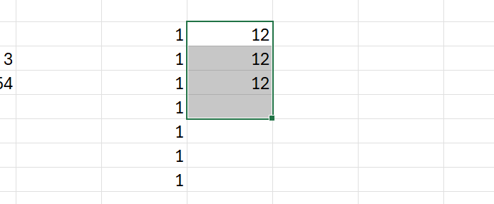

### Fill Types

Excel is smart about recognizing patterns when you use the fill handle — it can auto-continue:
- Number series (1, 2, 3… or 5, 10, 15…)
- Years (2023, 2024, 2025…)
- Months (Jan, Feb, Mar…) or days of the week (Mon, Tue, Wed…)

After dragging, a small **Auto Fill Options** icon appears — click it for more choices, like whether to copy cells exactly, fill a series, or fill formatting only.

### Fill Menu (Ribbon)

For more control — especially with larger tables — use the **Fill** command in the **Editing group** on the Home tab. This gives access to options like filling in a specific direction, setting a step value (increment), or a stop value for a series.

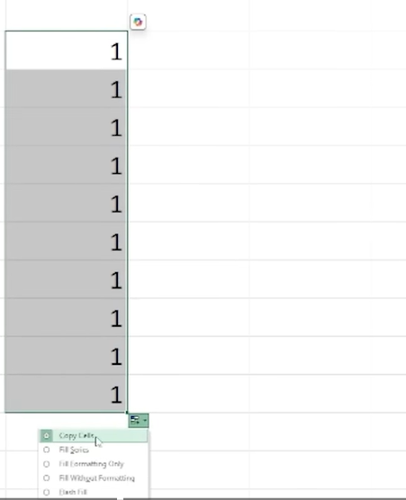

---

## 📌 Key Takeaways from Part 1

- A **workbook** holds many **worksheets**; Excel's UI is organized as Tabs → Ribbon → Groups → Menus.
- Prefer **Center Across Selection** over **Merge & Center** to avoid breaking your data structure.
- Always calculate with **cell references**, not hardcoded numbers — that's what makes a spreadsheet dynamic.
- Master the three reference types — **Relative**, **Absolute** (`$A$1`), **Mixed** (`$A1` / `A$1`) — since almost every intermediate formula depends on getting this right.
- The **Fill Handle** and **Fill menu** are the fastest ways to extend patterns, series, and formulas.

---

## 🔜 What's Next

**Part 2** will build on these fundamentals with formulas, functions, and formatting techniques used in real-world spreadsheets (conditional formatting, `IF`/`VLOOKUP`-style logic, and data validation).

---

*These are personal learning notes, written while studying Excel fundamentals — screenshots included for visual reference.*
